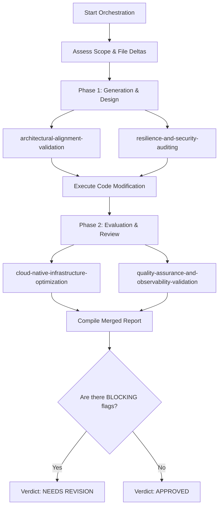

# Codebase Compliance Orchestration

This skill coordinates the four specialized validation skills to execute a structured, resource-efficient, and thorough code generation and evaluation lifecycle.

## Activation Criteria

Use this skill when:

- Bootstrapping a new project or major module from scratch.
- Conducting a complete review of a Pull Request (PR) or branch before merging.
- Running a scheduled or automated system audit across the codebase.
- Implementing features that touch multiple domains (e.g., architecture, database, API, and tests).

---

## Orchestration Logic & Conditional Routing

To minimize computational footprint and runtime costs, the orchestrator evaluates file modifications first, dynamically routing them to the relevant skills:

| Modified Asset Types | Targeted Skills to Activate |
| :--- | :--- |
| **Logic / Domain Code** (`*.py`, `*.ts`, `*.go`) | [architectural-alignment-validation](relative:///architectural-alignment-validation/SKILL.md)<br>[resilience-and-security-auditing](relative:///resilience-and-security-auditing/SKILL.md) |
| **Data / Cache Config / Queries** (`*.sql`, DB files, query scripts) | [cloud-native-infrastructure-optimization](relative:///cloud-native-infrastructure-optimization/SKILL.md)<br>[resilience-and-security-auditing](relative:///resilience-and-security-auditing/SKILL.md) |
| **Infrastructure / Containers** (`Dockerfile`, `*.tf`, `*.yaml`) | [cloud-native-infrastructure-optimization](relative:///cloud-native-infrastructure-optimization/SKILL.md) |
| **Tests & Schemas** (`*test*`, `openapi.yaml`, `*.proto`) | [quality-assurance-and-observability-validation](relative:///quality-assurance-and-observability-validation/SKILL.md) |

---

## Two-Phase Execution Workflow

Execution flows through two distinct, logical phases.



### Phase 1: Generation & Design (Creation)

Focuses on structural soundness and security posture prior to writing or deploying complex logic.

1. **Apply Architecture Guidelines:** Invoke [architectural-alignment-validation](relative:///architectural-alignment-validation/SKILL.md) on code paths to review class design, boundaries, and SOLID compliance.
2. **Apply Security Guidelines:** Invoke [resilience-and-security-auditing](relative:///resilience-and-security-auditing/SKILL.md) to audit input handling, exception pathways, and concurrency mechanisms.

### Phase 2: Evaluation & Review (Audit)

Focuses on operational performance, testing completeness, and contract compliance.

1. **Optimize Infrastructure & Performance:** Invoke [cloud-native-infrastructure-optimization](relative:///cloud-native-infrastructure-optimization/SKILL.md) to audit query complexity (N+1 issues), database transactional boundaries, caching configurations, and image efficiency.
2. **Validate Observability & QA:** Invoke [quality-assurance-and-observability-validation](relative:///quality-assurance-and-observability-validation/SKILL.md) to inspect structured telemetry formats, verify API contract compliance (RFC 7807), check test mocks, and verify version numbering (SemVer).

---

## Step-by-Step Orchestration Procedure

1. **Define Scope & Analyze Deltas:** Retrieve the current git diff or file scope. Match modified files with the *Orchestration Logic & Conditional Routing* table to determine which skills must be executed.
2. **Execute Phase 1 Checks:** Run architectural and security validations on the files flagged for change.
3. **Execute Phase 2 Checks:** Evaluate operational, caching, logging, and test definitions.
4. **Resolve Conflicts (Priority Rules):** If individual skills recommend conflicting steps, apply the following priority sequence: $$\text{Security \& Resilience} \rightarrow \text{Core Architecture} \rightarrow \text{Performance Optimization} \rightarrow \text{QA \& Observability}$$
5. **Evaluate Verdict & Compile Report:** Merge reports. If **any** sub-skill flags an issue as **BLOCKING**, the overall run verdict must be marked as `NEEDS REVISION`. If only **ADVISORY** issues or no issues are found, the verdict is marked as `APPROVED`.

---

## Output Format

The orchestrator must output a consolidated report following this structure:

```markdown
# Codebase Compliance Orchestration Report

## 1. Executive Summary

- **Overall Status:** [APPROVED / NEEDS REVISION]
- **Target Scope:** [List of scoped files/directories and analyzed git deltas]
- **Orchestration Run Time:** [Timestamp]

## 2. Phase 1: Design & Security Review

- **Architectural Conformance:** [Satisfied / Issues Found / Skipped]
  - *Key Notes:* [e.g., Decoupled domain contexts]
- **Resilience & Security Posture:** [Secure / Vulnerabilities Found / Skipped]
  - *Key Notes:* [e.g., Parameterized all SQL operations]

## 3. Phase 2: Deployment & Quality Review

- **Infrastructure & Caching:** [Optimized / Performance Risks Found / Skipped]
  - *Key Notes:* [e.g., Implemented cache TTLs and multi-stage container builds]
- **Observability & Test Suites:** [Compliant / Gaps Identified / Skipped]
  - *Key Notes:* [e.g., Structured logging configured; unit tests use injected mocks]

## 4. Required Actions & Diffs

[List all BLOCKING issues grouped by file, along with their associated git diffs or proposed code changes. List ADVISORY items below them as non-blocking recommendations]
```
```